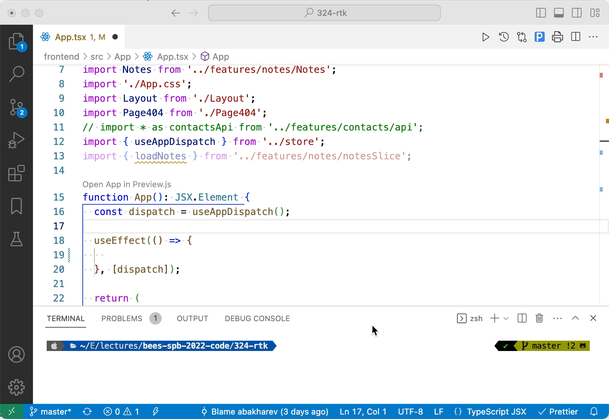

# GPilot (alpha version)



GPilot is a Visual Studio Code extension that offers AI-powered code completion. It is a free alternative to Github Copilot, powered by GPT3 official API.

IT'S NOT COMPLETELY FREE. You still need to retrieve Open AI API key to use it. After registration you get 18$ free (it will be enough for a looong time).

I'm trying to make this extension as similar to GitHub Copilot as possible. I would be glad to have your contribution.

## Installation

Clone the repository, install dependencies and build package:

```bash
git clone https://github.com/mrThomasTeller/vscode-gpilot
cd vscode-gpilot
npm i
npm run package
```

Run the command `Developer: Install Extension from Location...` in VS Code and choose `vscode-gpilot` folder.

## Usage

Place the cursor where you want the code suggestion and run the command `GPilot: Suggest code`.

## Todo

Problems I plan to fix soon:

- No preview of suggested code before inserting
- Sometimes a suggestion in human language is inserted instead of a code suggestion, or a part of already written code is duplicated
- Code is inserted without formatting to match the document style
- No warning about invalid API key or insufficient balance on Open AI account

## Contributing

If you want to contribute to this project, you can do so by forking the repository and sending a pull request or submitting an issue.

## License

This extension is licensed under the MIT License. See the `LICENSE` file for more information.
